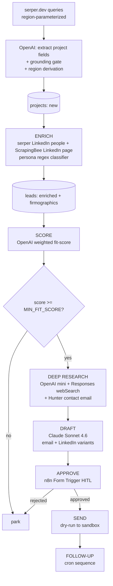

# groundbreaker

**Autonomous outbound BD pipeline for autonomous earthmoving.** Built as proof-of-work for [Lumina](https://luminatech.co)'s *AI Applications Specialist* role.

> Sources large-grading construction projects, enriches the companies and decision-makers behind them, scores each lead against Lumina's excavation-as-a-service fit, then drafts personalized outreach behind a human approval gate. **Dry-run only** — no real third parties are messaged.

---

## What you can see in this repo

A working 6-stage pipeline running against real data, with real artifacts in the Postgres store:

| | |
|---|---|
| **Projects discovered** | 4 (UK data-center campuses — Vantage, Ada, Kao, Google) |
| **Companies enriched** | 4 (full firmographics: domain, industry, HQ, headcount) |
| **Decision-makers identified** | 13 (titles, personas, LinkedIn URLs) |
| **Emails resolved** | 7 / 13 (Hunter, gated behind score) |
| **Leads scored** | 13 |
| **Deep-researched dossiers** | 8 (web-grounded, real source URLs) |
| **Drafts generated** | 8 leads × 2 channels (email + LinkedIn) = 16 outreach rows |
| **HITL decisions** | 1 approved (Rob Gire @ Vantage), 1 rejected, 6 awaiting review |

Every artifact is idempotent and traceable: re-running any workflow doesn't double-insert, and `runs` logs every execution. **See [`docs/demo.md`](docs/demo.md)** for the real rows — discovered projects with source URLs, scored leads with rationales, an LLM-generated research dossier, the actual draft Claude wrote for Rob Gire, and the HITL approval stamps.

## Pipeline

```
01_ingest  →  02_enrich  →  03_score  →  04_research  →  05_draft  →  06_approve  →  [07_send]  →  [08_followup]
   new          enriched      scored      researched      drafted      approved      sent          followup_n
```

The first six stages are built, published, and verified end-to-end. **Stages 7–8 are intentionally out of scope** for this proof-of-work — they are SMTP plumbing and a cron re-draft pattern that repeats stage 5's logic; the *substantive AI portion* (discover → enrich → score → research → draft → human-gate) is complete.

| # | Workflow | Trigger | Engine | Advances status |
|---|----------|---------|--------|-----------------|
| 1 | INGEST | hourly cron | serper.dev + OpenAI mini (Information Extractor) | `projects.new` |
| 2 | ENRICH | new projects | serper.dev + ScrapingBee (LinkedIn) + OpenAI mini | `leads.enriched` |
| 3 | SCORE | enriched | OpenAI mini (Information Extractor) | `leads.scored` |
| 4 | DEEP RESEARCH | `fit_score ≥ MIN_FIT_SCORE` | OpenAI mini + Responses API webSearch + Hunter | `leads.researched` |
| 5 | DRAFT | researched | Anthropic Claude Sonnet 4.6 | `leads.drafted` |
| 6 | APPROVE | drafted | human-in-the-loop via n8n Form Trigger | `leads.approved` / `rejected` |
| 7 | SEND (out of scope) | approved | Gmail/SMTP → `SANDBOX_OUTREACH_EMAIL` only | `leads.sent` |
| 8 | FOLLOW-UP (out of scope) | cron T+3d/+7d/+14d | Anthropic re-draft with different tone | `leads.followup_n` |

## Why this model split

Per `CLAUDE.md`, each call goes to the cheapest model that can do the job well:

- **serper.dev** — discovery queries; pure search, no LLM
- **OpenAI mini-class** — high-volume per-lead extraction + scoring + research. Cheap, fast, runs over hundreds of records
- **Anthropic Claude Sonnet 4.6** — the *one* place where draft quality compounds across the funnel: production outreach copy
- **Claude Code headless** (`claude -p`) — reserved for agentic deep-research on top-1% leads (not used in the current 4-lead demo set)

## Architecture

Eight n8n workflows over a shared PostgreSQL store (in a `n8n` schema for n8n's own tables, `public` for the domain). Each workflow advances exactly one lead-status transition.



See [`docs/architecture.md`](docs/architecture.md) for cross-cutting concerns, [`docs/scoring.md`](docs/scoring.md) for the fit-score formula, [`docs/sources.md`](docs/sources.md) for data sources and Hunter budget policy.

## Stack

- **n8n** (self-hosted, Docker) — workflow orchestration
- **PostgreSQL 16** — lead pipeline store; schema in [`db/init/001_schema.sql`](db/init/001_schema.sql)
- **serper.dev** — Google search API
- **OpenAI API** (mini class) — extraction, scoring, web-grounded research
- **Anthropic API** (Claude Sonnet 4.6) — production drafting
- **ScrapingBee** — LinkedIn company-page rendering
- **Hunter.io** (free tier, 50/mo) — email finder, gated to top-scored leads
- **n8n Form Trigger** — HITL approval gate

## Quickstart

```bash
git clone <this-repo> && cd groundbreaker
cp .env.example .env
# fill in: SERP_API_KEY, OPENAI_API_KEY, ANTHROPIC_API_KEY, HUNTER_API_KEY, SCRAPINGBEE_API_KEY
# (POSTGRES_PASSWORD and N8N_BASIC_AUTH_PASSWORD can be left blank — generated on first up)

docker compose up -d                    # starts n8n + postgres
# open http://localhost:5678 (default basic auth: see N8N_BASIC_AUTH_USER/PASSWORD in .env)
# in the n8n UI, import each workflow JSON from workflows/01_ingest.json ... 06_approve.json
# bind credentials (postgres, openAi, anthropic, scrapingBee, hunter) — once per credential type
# manually trigger 01_ingest, then 02_enrich → 03_score → 04_research → 05_draft
# submit the form at /form/approve-lead to approve/reject drafted leads
```

## Design decisions

A few choices that go beyond stitching nodes together:

**Idempotency everywhere.** `projects.dedup_hash` (deterministic hash over normalized name + state + owner) lets the discovery cron re-run hourly without doubling rows. `leads` has `UNIQUE(project_id, company_id, contact_id)`. Status-guarded `UPDATE`s (e.g. `WHERE status = 'drafted'`) make all stage advances safe to retry.

**Atomic CTE upserts.** Every multi-table write is a single Postgres query against `$1::jsonb`, not a fan-out of typed parameters. Avoids the n8n `queryReplacement` comma-split footgun that quietly truncates strings containing commas.

**Region derived from project, not query.** The discovery query origin (UK vs US-West) is *not* what determines region — the extracted project state is, via a state-to-region lookup map. A UK query that surfaces a Texas project gets correctly rejected as out-of-region.

**Grounding gate to kill hallucinations.** The Information Extractor in `01_ingest` and `02_enrich` only accepts an extracted entity if every significant word of its name appears in the source snippet. Caught a "Kevin Antonelli, B2B SaaS PM" hallucination from a search result that legitimately surfaced him at Google, but where the model invented his title.

**Persona regex is deliberately narrow.** The classifier returns `null` for biz dev, finance, MEP, and facilities-management titles. Those *should* be null — they are not target buyer personas for excavation-as-a-service. Score correctly demotes them.

**HITL gate via n8n Form Trigger, not Airtable.** Public form at `/form/approve-lead`, one CTE applies the decision and stamps approval rows. Lighter than Airtable + Zapier and lives inside the same orchestrator.

**Hunter quota discipline.** Free tier = 50 lookups/mo. Hunter only runs in stage 4, *behind* the `MIN_FIT_SCORE` gate — so credits are never spent on leads that didn't first clear the score bar. Stage 2 enrichment uses zero Hunter credits.

**Short-link domain normalization.** Google's LinkedIn page lists `goo.gle` as the website. Hunter can't resolve emails on that domain, so a small alias map in `02_enrich` normalizes known shortlinks (`goo.gle` → `google.com`, `fb.com` → `facebook.com`, etc.) before persisting.

## Repository layout

```
docker-compose.yml         # n8n + postgres
.env.example               # required API keys + tunables (TARGET_REGIONS, MIN_FIT_SCORE)
db/init/001_schema.sql     # postgres schema, auto-run on first boot
workflows/                 # 6 n8n workflow JSON exports (01_ingest ... 06_approve)
prompts/                   # canonical LLM prompts (mirrored into nodes)
docs/                      # architecture, scoring, sources
scripts/claude_research.sh # standalone Claude Code headless research helper
CLAUDE.md                  # project guidance for Claude Code agents
CHANGELOG.md               # session-by-session build log
```

## Guardrails

This is a **dry-run** system, by design:

- **Send stage targets sandbox addresses only.** Hard rule in `CLAUDE.md`: no real third parties.
- **Every send requires explicit human approval** via the HITL gate (stage 6).
- **Source ToS respected**: rate-limited HTTP nodes, retries with exponential backoff, ScrapingBee for LinkedIn (not raw scraping).
- **Hunter budget protected** behind the score gate.

---

*Built solo over ~3 working days as proof-of-work for the Lumina AI Applications Specialist role. See `CHANGELOG.md` for the build journal.*
