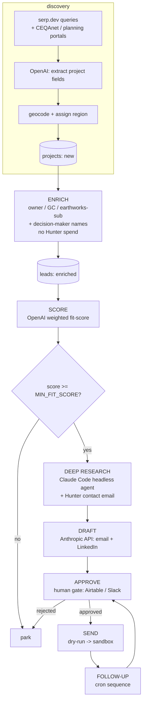

# Architecture

`groundbreaker` is eight n8n workflows over a shared PostgreSQL store. Each workflow owns one pipeline stage and advances a lead's `status`. All stages are idempotent and logged to the `runs` table.

## Workflow map

| # | Workflow | Trigger | Engine | Advances status to |
|---|----------|---------|--------|--------------------|
| 1 | INGEST | cron | serp.dev + OpenAI | `projects.new` |
| 2 | ENRICH | new projects | serp.dev + browser agent (firmographics + decision-maker names) | `enriched` |
| 3 | SCORE | enriched | OpenAI | `scored` |
| 4 | DEEP RESEARCH | scored ≥ threshold | Claude Code + Hunter (contact email, gated) | `researched` |
| 5 | DRAFT | researched | Anthropic API | `drafted` |
| 6 | APPROVE | drafted | human (Airtable/Slack) | `approved` / `rejected` |
| 7 | SEND | approved | Gmail/SMTP (sandbox) | `sent` |
| 8 | FOLLOW-UP | cron | Claude | `followup` |

## Cross-cutting

- **Idempotency:** `projects.dedup_hash` prevents reprocessing; upserts everywhere.
- **Reliability:** retry + exponential backoff on every HTTP node; an error-catch workflow posts failures to Slack.
- **Observability:** every run writes to `runs`; a metrics view reports counts per stage and estimated hours saved.
- **Config:** `TARGET_REGIONS` and `MIN_FIT_SCORE` are env-driven — no hardcoded geo or thresholds.
- **Quota discipline:** Hunter (Free tier, 50 lookups/mo) is the scarcest resource, so contact-email lookups run only behind the `MIN_FIT_SCORE` gate in stage 4 — never in bulk ENRICH — and are deduped by company domain. See `docs/sources.md`.
